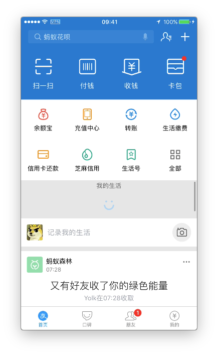
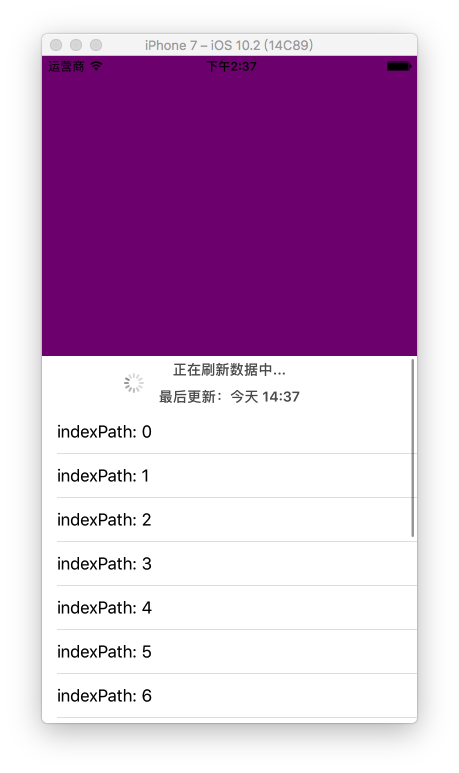

# AlipayHomeRefresh
支付宝首页下拉刷新的实现。

###简介
最近项目有需求要做类似支付宝首页的效果，在这种特殊位置下拉刷新的效果，如图：其他效果如导航栏效果这里暂不处理。如下图：


###需求分析
分析一下我们要实现的：

1. 在区域1的位置操作下拉刷新，结果是区域2进行了刷新的视觉效果。
2. 如果对屏幕任意位置操作上滑，整体都向上滑动了。
3. 右侧的滑动指示器在区域2位置开始

###方案设想
有很多种方法实现，这里讲一种我想到的简单实现

比较简单，层级结构就不上图了。直接写在这里

```
self.view(控制器View)
---	containerScrollView
------	topView
------	tableView
```	
self.view下的containerScrollView容器，容器里面放着topView(区域1)和tableView(区域2)。

###具体实现
主要由scrollView得代理方法来控制tableView的contentOffset

```
- (void)scrollViewDidScroll:(UIScrollView *)scrollView {
    CGFloat offsetY = self.containerScrollView.contentOffset.y;
	
	//scrollView在原位置下拉时候，设置tableViewcontentOffset
    if (offsetY <= 0) {     
        self.topView.y = offsetY;
        
        self.tableView.y = offsetY + kTopViewHeight;
        if (![self.tableView.mj_header isRefreshing]) {
            [self.tableView setContentOffset:CGPointMake(0, offsetY)];
        }
    }
}

-(void)scrollViewDidEndDragging:(UIScrollView *)scrollView willDecelerate:(BOOL)decelerate {
    
    CGFloat y = self.containerScrollView.contentOffset.y;
    //scrollView下拉到相应位置执行刷新
    if (y < - 55) { 
        [self.tableView.mj_header beginRefreshing];
    }
}

```

效果如下图：



###最后
欢迎大家继续完善，并提供其他更简单的实现方案。

下拉刷新用了[MJRefresh](https://github.com/CoderMJLee/MJRefresh)框架

为了frame方便书写，写了`UIView+Size`的分类

若Clone下来编译错误，请在项目路径下执行`pod install`后重新编译运行